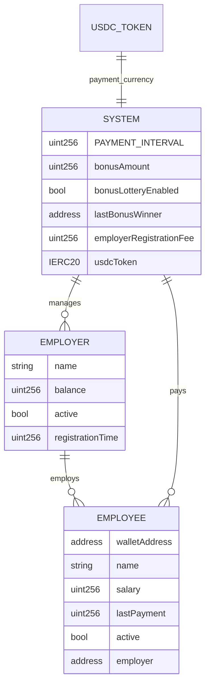
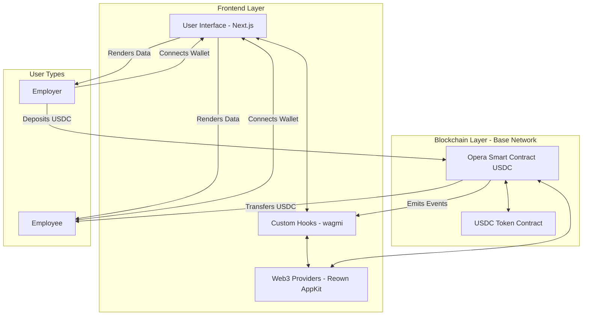

# Opera - Open Payroll Raising Automatically

Opera is a decentralized payroll system built on blockchain technology that manages salary payments with USDC stablecoin, increases transparency, and eliminates traditional banking limitations through smart contracts on the Base network.



## Key Features

### USDC Stablecoin Payments

Opera uses USDC (USD Coin) as the primary payment currency, providing:
- **Price Stability**: Employees receive predictable value pegged to USD
- **Fast Transactions**: Leverages Base network for quick, low-cost transfers
- **Wide Acceptance**: USDC is widely supported and easily convertible
- **Transparency**: All transactions are on-chain and verifiable

The smart contract ([OperaContractUSDC.sol](./OperaContractUSDC.sol)) handles:
1. USDC deposits from employers to contract balance
2. Salary payments in USDC to employees
3. Registration fees in USDC
4. Bonus lottery system in USDC (when enabled)

## Project Description

Opera (Open Payroll Raising Automatically) is a blockchain-based payroll system that automates compensation for organizations of any size. The platform enables employers to manage their workforce, handle compensation, and distribute payments automatically through smart contracts.



### The Problem Opera Solves

Traditional payroll systems suffer from several critical limitations:

1. **Manual Processing Overhead**: Conventional payroll requires significant human intervention, creating inefficiencies and opportunities for error
2. **Payment Delays**: Traditional banking systems impose arbitrary waiting periods between payment initiation and receipt
3. **Geographic Restrictions**: International payments involve excessive fees, unfavorable exchange rates, and lengthy delays
4. **Transparency Issues**: Employees often lack visibility into payment processing status and timing
5. **Administrative Burden**: Companies dedicate substantial resources to manage recurring payroll operations

Opera addresses these challenges by leveraging blockchain technology and smart contract automation to create a trustless, transparent, and efficient payroll system.

### Core Features

#### For Employers

- **Streamlined Registration**: Employers register on-chain by paying a registration fee in USDC, establishing their company profile with minimal overhead
- **Comprehensive Employee Management**: Add, update, or remove employees with complete record-keeping of all changes
- **Secure Fund Management**: Deposit and manage USDC payroll funds with segregated balances and role-based access controls
- **Manual Payment Execution**: Trigger payments to all employees with a single transaction call (`payMyEmployees`)
- **Bonus Lottery System**: Optionally run manual bonus lottery to reward random employees (owner-controlled feature)
- **Financial Analytics**: Track payment history, USDC fund utilization, and payroll projections

#### For Employees

- **Digital Employment Records**: Maintain cryptographically secured proof of employment with immutable compensation terms
- **Payment Transparency**: Gain complete visibility into payment schedules, USDC amounts, and history
- **Direct USDC Payments**: Receive USDC payments directly to personal wallet when employer triggers payroll
- **Bonus Eligibility**: Potential to receive random bonus payments in USDC (when lottery is enabled)
- **Financial Visibility**: Access personal payment analytics and history with blockchain verification

### Technical Stack

#### Smart Contract Infrastructure

- **Solidity 0.8.19**: Latest stable version with enhanced type safety and gas optimizations
- **USDC Integration**: ERC-20 stablecoin integration using SafeERC20 for secure token transfers
- **Base Network**: Deployed on Base Mainnet and Base Sepolia testnet for low-cost, fast transactions
- **OpenZeppelin Libraries**: Production-tested implementation of:
  - Access control (Ownable)
  - Security patterns (ReentrancyGuard)
  - Safe ERC-20 token handling (SafeERC20)
- **EVM Compatibility**: Works on any Ethereum Virtual Machine compatible network supporting USDC

#### Frontend Technology

- **Next.js 15.3.4**: Server-side rendering and modern React features for optimal performance
- **React 19**: Latest React version with enhanced rendering capabilities
- **TypeScript 5**: Static typing throughout the codebase for improved reliability
- **wagmi 2.15+**: React hooks for Ethereum interaction with automatic state management
- **Reown AppKit (formerly WalletConnect)**: Multi-wallet connection support
- **@tanstack/react-query**: Powerful data fetching and caching
- **shadcn/ui + Radix UI**: Accessible, customizable component library for consistent UI/UX
- **TailwindCSS 4**: Utility-first CSS framework for responsive, maintainable styling
- **date-fns 4**: Comprehensive datetime handling for payment schedules and countdown timers
- **Motion (Framer Motion)**: Smooth animations and transitions

#### Authentication and Data Management

- **Web3 Wallet Authentication**: Non-custodial authentication using Reown AppKit supporting MetaMask, WalletConnect, and other wallets
- **On-Chain Data Storage**: Critical business logic and financial records stored immutably on Base blockchain
- **Client-Side Data Processing**: Efficient handling of blockchain data with react-query caching and state management
- **USDC Token Management**: Approve and transfer USDC tokens via standard ERC-20 interface

## Architecture Overview

Opera follows a decentralized architecture with three main components:

### 1. Smart Contract Layer

The smart contract serves as the system's core, containing all business logic, access controls, and data storage. Key architectural elements include:

- **Data Structures**:
  - `Employer` struct: Contains employer details, USDC balance, and status
  - `Employee` struct: Stores employee information, USDC salary, payment history, and status
  - Mappings and arrays for efficient data access and enumeration

- **Access Control System**:
  - Owner-level administrative functions for system management (bonus lottery, registration fees)
  - Employer-specific permissions for workforce and fund management (onlyEmployer modifier)
  - Employee management restricted to the employing organization

- **USDC Fund Management**:
  - Segregated employer USDC balances to prevent cross-contamination
  - SafeERC20 for secure token transfers
  - ReentrancyGuard protection against recursive attack vectors
  - Approval mechanism for USDC deposits and payments

- **Event System**:
  - Comprehensive event emissions for all state changes
  - Indexed parameters for efficient off-chain filtering and monitoring
  - Events for payments, registrations, employee management, and fund deposits

### 2. Web Interface Layer

The frontend provides intuitive access to contract functionality through purpose-built dashboards:

- **Authentication Flow**:
  - Web3 wallet connection via Reown AppKit for secure, non-custodial authentication
  - Role detection for dynamic UI rendering (employer vs. employee)
  - Network verification to ensure connection to Base Mainnet or Base Sepolia
  - Protected routes for employer-only and employee-only pages

- **State Management**:
  - Custom wagmi hooks for blockchain data fetching and caching
  - React Query for optimized data synchronization
  - Real-time updates on transactions and contract state changes
  - USDC balance and allowance tracking

- **Interface Components**:
  - Employer dashboard for workforce and USDC fund management
  - Employee dashboard for payment tracking and salary verification
  - USDC approval and deposit flows with transaction monitoring
  - Transaction history with Base blockchain explorer links
  - Financial analytics showing USDC balances and payment projections

### 3. Blockchain Network Layer

The blockchain provides the settlement layer and source of truth:

- **Transaction Processing**:
  - Employer-initiated transactions (registration with USDC fee, employee management, USDC deposits)
  - Manual payment execution by employers (`payMyEmployees` function)
  - USDC token approvals and transfers
  - Gas-optimized for Base network's low transaction costs

- **Data Persistence**:
  - Immutable record of all system activities on Base blockchain
  - Transparent, verifiable state accessible to all participants
  - Historical data for compliance and audit purposes
  - All USDC transactions traceable on-chain

### Security Considerations

The system incorporates multiple security mechanisms:

- **Smart Contract Security**:
  - Comprehensive access controls with onlyOwner and onlyEmployer modifiers
  - ReentrancyGuard protection for all USDC transfers
  - Input validation and error handling throughout
  - Use of well-audited OpenZeppelin components (Ownable, ReentrancyGuard, SafeERC20)
  - SafeERC20 prevents common ERC-20 vulnerabilities

- **Economic Security**:
  - Segregated USDC balances per employer to prevent cross-contamination
  - Balance verification before payment execution
  - Registration fee in USDC to prevent spam registrations
  - Emergency withdraw function for owner (contract recovery)

- **Operational Security**:
  - Event logging for all critical state changes and USDC transfers
  - Two-step USDC transfer (approve + depositFunds) for user awareness
  - Employee payment tracking to prevent duplicate payments within interval
  - Role-based access control for all sensitive operations

## Smart Contract Details

### Contract Structure

The [OperaContractUSDC.sol](./OperaContractUSDC.sol) file implements the entire USDC-based payroll system with the following key components:

#### Core Data Structures

```solidity
// USDC token interface
IERC20 public immutable usdcToken;

struct Employer {
    string name;
    uint256 balance;  // Balance in USDC (6 decimals)
    bool active;
    uint256 registrationTime;
}

struct Employee {
    address walletAddress;
    string name;
    uint256 salary;  // Salary in USDC (6 decimals)
    uint256 lastPayment;
    bool active;
    address employer;
}

mapping(address => Employee) public employees;
mapping(address => Employer) public employers;
mapping(address => address[]) public employerToEmployees;
address[] public employerAddresses;
address[] public employeeAddresses;
```

#### Key Constants and State Variables

```solidity
uint256 public constant PAYMENT_INTERVAL = 30 days;
uint256 public bonusAmount = 100 * 10**6;  // 100 USDC (6 decimals)
bool public bonusLotteryEnabled = true;
address public lastBonusWinner;
uint256 public employerRegistrationFee = 10 * 10**6;  // 10 USDC (6 decimals)
```

#### Major Function Groups

1. **Employer Management**:
   - `registerAsEmployer(string _name)`: Register as employer by transferring USDC registration fee
   - `depositFunds(uint256 _amount)`: Deposit USDC to employer balance (requires prior USDC approval)
   - `setEmployerStatus(address, bool)`: Owner function to activate/deactivate employers
   - `setEmployerRegistrationFee(uint256)`: Owner function to update registration fee

2. **Employee Management**:
   - `addEmployee(address, string, uint256)`: Add new employee with USDC salary amount
   - `removeEmployee(address)`: Deactivate employee and remove from lists
   - `updateSalary(address, uint256)`: Update employee's USDC salary

3. **Payment Processing**:
   - `_payEmployee(address)`: Internal function to transfer USDC to employee
   - `payMyEmployees()`: Employer-triggered function to pay all their employees
   - `payAllEmployees()`: Owner function to trigger payments for all employers (if enabled)

4. **Bonus System** (Owner-controlled):
   - `runBonusLotteryManually()`: Manually trigger bonus lottery using pseudo-random selection
   - `setBonusAmount(uint256)`: Configure USDC bonus amount
   - `toggleBonusLottery(bool)`: Enable/disable the bonus feature

5. **View Functions**:
   - `getEmployerBalance(address)`: Get employer's USDC balance
   - `getEmployeeCountForEmployer(address)`: Count employees for an employer
   - `getTotalMonthlySalaryForEmployer(address)`: Calculate total monthly USDC payroll
   - `getContractBalance()`: Get total USDC held by contract
   - `getUsdcAddress()`: Get USDC token contract address
   - Various counters and getters for system information

### Contract Events

The contract emits events for all significant state changes:

```solidity
event EmployerRegistered(address indexed employerAddress, string name);
event EmployerDeactivated(address indexed employerAddress);
event EmployerFundsDeposited(address indexed employerAddress, uint256 amount);  // amount in USDC
event EmployeeAdded(address indexed employerAddress, address indexed employeeAddress, string name, uint256 salaryUsdc);
event EmployeeRemoved(address indexed employerAddress, address indexed employeeAddress);
event SalaryUpdated(address indexed employerAddress, address indexed employeeAddress, uint256 newSalaryUsdc);
event PaymentSent(address indexed employerAddress, address indexed employeeAddress, uint256 amount);  // amount in USDC
event BonusWinnerSelected(address indexed winner, uint256 amount);  // amount in USDC
event BonusAmountUpdated(uint256 newAmount);  // amount in USDC
event BonusLotteryToggled(bool enabled);
event EmployerRegistrationFeeUpdated(uint256 newFee);  // fee in USDC
```

## Frontend Implementation Details

### Key Components and Hooks

The frontend architecture is built around reusable hooks and components:

#### Contract Interaction Hooks

```typescript
// src/hooks/use-opera-contract.tsx - Main contract interactions
export function useEmployerDetails(employerAddress?: string)  // Get employer info
export function useEmployeeCount(employerAddress?: string)    // Count employees
export function useEmployerBalance(employerAddress?: string)  // Get USDC balance
export function useTotalMonthlySalary(employerAddress?: string) // Calculate total payroll
export function useRegisterAsEmployer()  // Register with USDC fee
export function useDepositFunds()        // Deposit USDC (requires approval)
export function useAddEmployee()         // Add new employee
export function usePayEmployees()        // Trigger payroll
export function useEmployeeDetails(employeeAddress: string)  // Get employee info
export function useIsEmployer()          // Check if address is employer
export function useUpdateSalary()        // Update employee salary
export function useRemoveEmployee()      // Remove employee

// src/hooks/use-usdc.tsx - USDC token interactions
export function useUsdcBalance()         // Get user's USDC balance
export function useUsdcAllowance()       // Check USDC allowance for contract
export function useApproveUsdc()         // Approve USDC spending

// src/hooks/use-contract-address.tsx - Network-aware contract address
export function useContractAddress()     // Get contract address for current network

// src/hooks/use-usdc-address.tsx - Network-aware USDC address
export function useUsdcAddress()         // Get USDC address for current network
```

#### Key UI Components

```typescript
// Employer components
<EmployeesTable employerAddress={address} />      // Display employees with USDC salaries
<TransactionHistory employerAddress={address} />  // Show payment history
// USDC deposit flow handled inline with approve + deposit

// Employee components
<EmployeeDashboard />                             // Employee overview with salary info
// Payment tracking shown in dashboard

// Layout components
<Navbar />                                        // Navigation with wallet connect
<Footer />                                        // Site footer
<ConnectButton />                                 // Reown AppKit wallet connection
```

#### Page Structure

```typescript
// src/app/page.tsx                     - Landing page
// src/app/register/page.tsx            - Employer registration
// src/app/employer/page.tsx            - Employer dashboard
// src/app/employer/employees/page.tsx  - Employee management
// src/app/employer/employees/add/page.tsx - Add employee form
// src/app/employee/page.tsx            - Employee dashboard
```

#### Authentication and Protection

```typescript
// src/components/protected-route.tsx
export default function ProtectedRoute({
    children,
    requireEmployer = false,
    requireNotEmployer = false,
    redirectTo = '/'
}: ProtectedRouteProps) {
    const { isConnected } = useAccount()
    const { isEmployer, isLoading } = useIsEmployer()
    // Redirects based on wallet connection and employer status
}
```

## Getting Started

### Prerequisites

- Node.js 18+ (recommended Node.js 20 LTS)
- npm, pnpm, or yarn package manager
- Web3 wallet (MetaMask, Coinbase Wallet, or any WalletConnect-compatible wallet)
- Access to Base Mainnet or Base Sepolia testnet
- USDC tokens for testing (on testnet) or production use (on mainnet)

### Installation

1. Clone the repository
```bash
git clone https://github.com/yourusername/opera.git
cd opera
```

2. Install dependencies
```bash
pnpm install
```

3. Create a `.env.local` file with required environment variables
```env
NEXT_PUBLIC_ALCHEMY_API_KEY=your_alchemy_api_key
NEXT_PUBLIC_REOWN_PROJECT_ID=your_reown_project_id
```

Get your keys:
- **Alchemy API Key**: Sign up at [https://www.alchemy.com/](https://www.alchemy.com/) and create a new app for Base network
- **Reown Project ID**: Visit [https://cloud.reown.com](https://cloud.reown.com) (formerly WalletConnect) to create a project

4. Start the development server
```bash
pnpm dev
```

5. Access the application
Open your browser and navigate to `http://localhost:3000`

### Smart Contract Deployment

The contract is already deployed on:
- **Base Mainnet**: `0xbf2DCB5Baa80b6A2029B3930f39B052bbbee8E57`
- **Base Sepolia**: `0x929b6074A4Fd5Bc4eEEB18522Bbc2eD6578dC564`

#### Deploying Your Own Contract

If you want to deploy your own instance:

1. **Prepare Deployment**:
   - Get USDC token address for your target network:
     - Base Mainnet: `0x833589fCD6eDb6E08f4c7C32D4f71b54bdA02913`
     - Base Sepolia: `0x036CbD53842c5426634e7929541eC2318f3dCF7e`

2. **Deploy Contract** (using Remix, Hardhat, or Foundry):

```solidity
// Constructor parameter: USDC token address
constructor(address _usdcToken) Ownable(msg.sender) {
    require(_usdcToken != address(0), "Invalid USDC token address");
    usdcToken = IERC20(_usdcToken);
    _registerEmployer(msg.sender, "System Admin", true);
}
```

Example using Hardhat:

```javascript
// scripts/deploy.js
const hre = require("hardhat");

async function main() {
  // Base Sepolia USDC address
  const USDC_ADDRESS = "0x036CbD53842c5426634e7929541eC2318f3dCF7e";

  const OperaUSDC = await hre.ethers.getContractFactory("OperaContractUSDC");
  const opera = await OperaUSDC.deploy(USDC_ADDRESS);

  await opera.deployed();
  console.log("Opera USDC Contract deployed to:", opera.address);
}

main().catch((error) => {
  console.error(error);
  process.exitCode = 1;
});
```

3. **Configure Frontend**:
   - Update contract addresses in [src/lib/contracts.ts](./src/lib/contracts.ts):
   ```typescript
   export const CONTRACT_ADDRESS_BASE_MAINNET = "your_deployed_address";
   export const CONTRACT_ADDRESS_BASE_SEPOLIA = "your_deployed_address";
   ```

### Configuration Options

#### Smart Contract Configuration (Owner-Only)

- `PAYMENT_INTERVAL`: Payment cycle duration (constant: 30 days)
- `bonusAmount`: Amount for random bonuses in USDC (default: 100 USDC / 100000000 with 6 decimals)
- `bonusLotteryEnabled`: Toggle for bonus functionality (default: true)
- `employerRegistrationFee`: Fee for new employer registration in USDC (default: 10 USDC / 10000000 with 6 decimals)

Modify these via owner functions:
```solidity
setBonusAmount(uint256 _newBonusAmount)              // Update bonus amount
toggleBonusLottery(bool _enabled)                    // Enable/disable lottery
setEmployerRegistrationFee(uint256 _newFee)          // Update registration fee
```

#### Frontend Environment Variables

- `NEXT_PUBLIC_ALCHEMY_API_KEY`: API key for Alchemy RPC services (Base network)
- `NEXT_PUBLIC_REOWN_PROJECT_ID`: Project ID for Reown/WalletConnect integration

The app automatically connects to the correct network (Base Mainnet or Base Sepolia) based on user's wallet connection.

## Usage Examples

### Employer Workflow

#### Register as an Employer

```typescript
import { useRegisterAsEmployer } from '@/hooks/use-opera-contract';

function RegistrationForm() {
    const [companyName, setCompanyName] = useState('');
    const { register, isPending, isConfirmed } = useRegisterAsEmployer();

    const handleRegister = async () => {
        try {
            await register(companyName);
            // Handle success
        } catch (error) {
            // Handle error
        }
    };

    return (
        <form onSubmit={(e) => { e.preventDefault(); handleRegister(); }}>
            <input value={companyName} onChange={(e) => setCompanyName(e.target.value)} />
            <button type="submit" disabled={isPending}>Register</button>
        </form>
    );
}
```

#### Add an Employee

```typescript
import { useAddEmployee } from '@/hooks/use-opera-contract';

function AddEmployeeForm() {
    const [name, setName] = useState('');
    const [walletAddress, setWalletAddress] = useState('');
    const [salary, setSalary] = useState('');
    const { addEmployee, isPending } = useAddEmployee();

    const handleAddEmployee = async () => {
        try {
            await addEmployee(walletAddress, name, salary);
            // Handle success
        } catch (error) {
            // Handle error
        }
    };

    return (
        // Form implementation
    );
}
```

### Employee Workflow

```typescript
import { useEmployeeDetails } from '@/hooks/use-opera-contract';
import { formatUnits } from 'viem';

function EmployeeDashboard() {
    const { address } = useAccount();
    const { employee, isLoading } = useEmployeeDetails(address || '');

    if (isLoading) return <div>Loading...</div>;

    return (
        <div>
            <h2>Welcome, {employee.name}</h2>
            <p>Salary: {formatUnits(employee.salary, 6)} USDC</p>
            <p>Next payment: {calculateNextPayment(employee.lastPayment)}</p>
            <p>Employer: {employee.employer}</p>
            {/* Additional employee information */}
        </div>
    );
}
```

### USDC Approval and Deposit Flow

```typescript
import { useApproveUsdc } from '@/hooks/use-usdc';
import { useDepositFunds } from '@/hooks/use-opera-contract';
import { parseUnits } from 'viem';

function DepositFundsFlow() {
    const [amount, setAmount] = useState('');
    const { approve, isPending: isApproving } = useApproveUsdc();
    const { deposit, isPending: isDepositing } = useDepositFunds();

    const handleDeposit = async () => {
        const amountInUsdc = parseUnits(amount, 6); // USDC has 6 decimals

        // Step 1: Approve USDC
        await approve(amountInUsdc);

        // Step 2: Deposit funds
        await deposit(amountInUsdc);
    };

    return (
        <div>
            <input
                type="number"
                value={amount}
                onChange={(e) => setAmount(e.target.value)}
                placeholder="Amount in USDC"
            />
            <button
                onClick={handleDeposit}
                disabled={isApproving || isDepositing}
            >
                {isApproving ? 'Approving...' : isDepositing ? 'Depositing...' : 'Deposit USDC'}
            </button>
        </div>
    );
}
```

## Testing

### Testing on Base Sepolia

1. **Get Testnet ETH**:
   - Visit [Base Sepolia Faucet](https://www.coinbase.com/faucets/base-ethereum-goerli-faucet)
   - Request testnet ETH for gas fees

2. **Get Testnet USDC**:
   - Use a USDC faucet or DEX on Base Sepolia
   - USDC Address: `0x036CbD53842c5426634e7929541eC2318f3dCF7e`

3. **Test Employer Flow**:
   - Connect wallet to Base Sepolia
   - Approve 10 USDC for registration fee
   - Register as employer
   - Approve USDC for deposit
   - Deposit USDC to contract balance
   - Add employees
   - Trigger payment

4. **Test Employee Flow**:
   - Connect with employee wallet
   - View employment details
   - Monitor payment history
   - Check USDC balance after payment

### Smart Contract Testing

For testing the smart contract with Hardhat or Foundry:

```javascript
describe("OperaContractUSDC", function () {
  let opera, usdc;
  let owner, employer, employee;

  beforeEach(async function () {
    // Deploy mock USDC
    const MockUSDC = await ethers.getContractFactory("MockERC20");
    usdc = await MockUSDC.deploy("USDC", "USDC", 6);

    // Deploy Opera contract
    const Opera = await ethers.getContractFactory("OperaContractUSDC");
    opera = await Opera.deploy(usdc.address);

    // Fund accounts with mock USDC
    await usdc.mint(employer.address, parseUnits("10000", 6));
  });

  describe("Employer Registration", function () {
    it("Should require USDC approval for registration", async function () {
      await usdc.connect(employer).approve(opera.address, parseUnits("10", 6));
      await opera.connect(employer).registerAsEmployer("Test Company");
    });
  });

  describe("Payment Processing", function () {
    it("Should transfer USDC to employees", async function () {
      // Test USDC payment flow
    });
  });
});
```

## Development Workflow

### Branching Strategy

- `main`: Production-ready code
- `develop`: Integration branch for features
- `feature/*`: Individual feature branches
- `bugfix/*`: Bug fix branches

### Contribution Guidelines

1. Fork the repository
2. Create a feature branch (`git checkout -b feature/amazing-feature`)
3. Commit your changes (`git commit -m 'Add some amazing feature'`)
4. Push to the branch (`git push origin feature/amazing-feature`)
5. Open a Pull Request against the `develop` branch

### Code Style and Linting

The project enforces consistent code style using ESLint and TypeScript:

```bash
# Run linter
pnpm lint

# Fix automatic linting issues
pnpm lint:fix
```

## Deployed Contracts

### Contract Addresses

| Network | Contract Address | USDC Address | Explorer |
|---------|------------------|--------------|----------|
| Base Mainnet | `0xbf2DCB5Baa80b6A2029B3930f39B052bbbee8E57` | `0x833589fCD6eDb6E08f4c7C32D4f71b54bdA02913` | [BaseScan](https://basescan.org/address/0xbf2DCB5Baa80b6A2029B3930f39B052bbbee8E57) |
| Base Sepolia | `0x929b6074A4Fd5Bc4eEEB18522Bbc2eD6578dC564` | `0x036CbD53842c5426634e7929541eC2318f3dCF7e` | [BaseScan Testnet](https://sepolia.basescan.org/address/0x929b6074A4Fd5Bc4eEEB18522Bbc2eD6578dC564) |

## Future Development

Future enhancements planned for Opera include:

### Payment Automation

- **Chainlink Automation Integration**: Automatic payroll execution every 30 days without manual triggering
- **Scheduled Payments**: Pre-scheduled payment dates and recurring transfers
- **Flexible Payment Intervals**: Support for weekly, bi-weekly, or custom pay periods

### Token & Payment Options

- **Multi-Stablecoin Support**: Accept USDT, DAI, and other stablecoins alongside USDC
- **Multi-token Salaries**: Allow employees to receive payment in their preferred token
- **Fiat On/Off Ramps**: Integration with services like Coinbase Commerce for fiat conversion
- **Cross-chain Payments**: Support for multiple blockchain networks (Ethereum, Polygon, Arbitrum, Optimism)

### Enhanced Features

- **Verifiable Randomness**: Integrate Chainlink VRF for provably fair bonus lottery
- **Tax Withholding**: Automatic tax calculation and withholding based on jurisdiction
- **Invoice Generation**: Automated payslip and tax document generation
- **Escrow System**: Hold funds in escrow until payment conditions are met
- **Partial Payments**: Support for advance payments and payment installments

### Enterprise & Compliance

- **Multi-signature Wallets**: Require multiple approvals for large transactions
- **Role-Based Access Control**: Department managers, HR roles, finance roles
- **Audit Trails**: Comprehensive logging for compliance and reporting
- **Department Structure**: Organize employees by departments and teams
- **Benefits Management**: Track and manage employee benefits and bonuses
- **Time & Attendance**: Integration with time tracking for hourly workers

### User Experience

- **Mobile App**: React Native mobile application for iOS and Android
- **Email Notifications**: Alert employees of upcoming and completed payments
- **Dashboard Analytics**: Advanced charts and reports for payroll insights
- **CSV Import/Export**: Bulk employee management via CSV files
- **API Access**: RESTful API for third-party integrations

## License

This project is licensed under the MIT License - see the [LICENSE](LICENSE) file for details.

## Acknowledgments

- [Base](https://base.org/) for providing a fast, low-cost Layer 2 blockchain infrastructure
- [Circle](https://www.circle.com/) for USDC stablecoin infrastructure
- [OpenZeppelin](https://openzeppelin.com/) for secure smart contract components (Ownable, ReentrancyGuard, SafeERC20)
- [Reown (WalletConnect)](https://reown.com/) for multi-wallet connection infrastructure
- [shadcn/ui](https://ui.shadcn.com/) for the accessible component system
- [Radix UI](https://www.radix-ui.com/) for unstyled, accessible UI primitives
- [Vercel](https://vercel.com/) for Next.js framework and hosting platform
- [Alchemy](https://www.alchemy.com/) for reliable RPC infrastructure

## Contributing

Contributions are welcome! Please feel free to submit a Pull Request. For major changes, please open an issue first to discuss what you would like to change.

## Support

If you encounter any issues or have questions:
- Open an issue on [GitHub](https://github.com/yourusername/opera/issues)
- Check the [documentation](./README.md)
- Review contract code in [OperaContractUSDC.sol](./OperaContractUSDC.sol)

## Security

If you discover a security vulnerability, please send an email to security@yourproject.com. Please do not open a public issue for security vulnerabilities.
