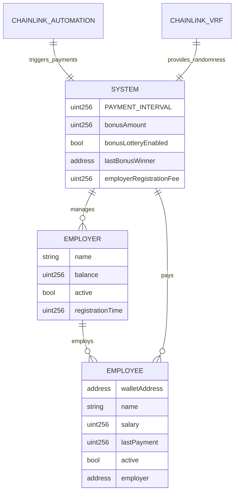
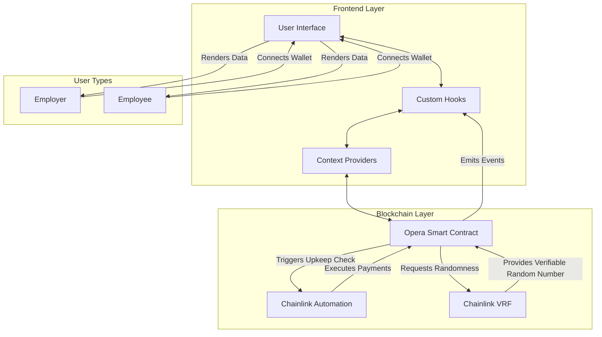

# Opera - Open Payroll Raising Automatically

Opera is a decentralized payroll system built on blockchain technology that automates salary payments, increases transparency, and eliminates traditional banking limitations through smart contract automation.

## Chainlink Integration

This project leverages multiple Chainlink services to enable core functionality:



### Chainlink Automation

Opera uses Chainlink Automation (formerly Keepers) to enable fully automated payroll execution. The system automatically checks if payments are due and processes them without requiring manual intervention.

The implementation uses a time-based trigger pattern where:
1. `checkUpkeep` evaluates employee payment conditions (active status, time since last payment, sufficient employer balance)
2. `performUpkeep` executes the payment cycle when conditions are met, processing all eligible payments in a single transaction

**Files implementing Chainlink Automation:**
- [OperaContract.sol](./OperaContract.sol) - lines 449-470: `checkUpkeep` and `performUpkeep` functions

```solidity
function checkUpkeep(bytes calldata /* checkData */) external view override returns (bool upkeepNeeded, bytes memory /* performData */) {
    upkeepNeeded = false;

    for (uint256 i = 0; i < employeeAddresses.length; i++) {
        address employeeAddress = employeeAddresses[i];
        Employee storage employee = employees[employeeAddress];

        if (employee.active &&
            block.timestamp >= employee.lastPayment + PAYMENT_INTERVAL &&
            employers[employee.employer].balance >= employee.salary) {
            upkeepNeeded = true;
            break;
        }
    }

    return (upkeepNeeded, "");
}

function performUpkeep(bytes calldata /* performData */) external override {
    _payAllEmployees();
}
```

### Chainlink VRF (Verifiable Random Function)

Opera implements a bonus lottery system powered by Chainlink VRF, ensuring that bonus recipient selection is provably fair and cannot be manipulated by any party, including the contract creators.

The implementation follows a complete request-receive pattern:
1. `_requestRandomness` initiates a VRF request after the payroll cycle completes
2. `fulfillRandomWords` processes the random value to select a bonus winner from active employees
3. The selected employee receives an immediate bonus payment

**Files implementing Chainlink VRF:**
- [OperaContract.sol](./OperaContract.sol) - lines 472-538: `_requestRandomness` and `fulfillRandomWords` functions

```solidity
function _requestRandomness() internal {
    require(address(this).balance >= bonusAmount, "Insufficient balance for bonus");

    uint256 activeEmployees = 0;
    for (uint256 i = 0; i < employeeAddresses.length; i++) {
        if (employees[employeeAddresses[i]].active) {
            activeEmployees++;
        }
    }
    require(activeEmployees > 0, "No active employees");

    lastRequestId = COORDINATOR.requestRandomWords(
        s_keyHash,
        uint64(s_subscriptionId),
        REQUEST_CONFIRMATIONS,
        CALLBACK_GAS_LIMIT,
        NUM_WORDS
    );

    emit RandomnessRequested(lastRequestId);
}

function fulfillRandomWords(
    uint256,
    uint256[] memory _randomWords
) internal override {
    // Random winner selection logic...
    uint256 winnerIndex = _randomWords[0] % activeEmployeesCount;
    // Winner payment logic...
}
```

## Project Description

Opera (Open Payroll Raising Automatically) is a blockchain-based payroll system that automates compensation for organizations of any size. The platform enables employers to manage their workforce, handle compensation, and distribute payments automatically through smart contracts.



### The Problem Opera Solves

Traditional payroll systems suffer from several critical limitations:

1. **Manual Processing Overhead**: Conventional payroll requires significant human intervention, creating inefficiencies and opportunities for error
2. **Payment Delays**: Traditional banking systems impose arbitrary waiting periods between payment initiation and receipt
3. **Geographic Restrictions**: International payments involve excessive fees, unfavorable exchange rates, and lengthy delays
4. **Transparency Issues**: Employees often lack visibility into payment processing status and timing
5. **Administrative Burden**: Companies dedicate substantial resources to manage recurring payroll operations

Opera addresses these challenges by leveraging blockchain technology and smart contract automation to create a trustless, transparent, and efficient payroll system.

### Core Features

#### For Employers

- **Streamlined Registration**: Employers register on-chain with a simple transaction, establishing their company profile with minimal overhead
- **Comprehensive Employee Management**: Add, update, or remove employees with complete record-keeping of all changes
- **Secure Fund Management**: Deposit and manage payroll funds with segregated balances and role-based access controls
- **Automated Payments**: Scheduled payments execute automatically every 30 days without manual intervention, leveraging Chainlink Automation
- **Bonus Incentives**: Distribute random bonuses using Chainlink VRF for verifiably fair recipient selection
- **Financial Analytics**: Track payment history, fund utilization, and payroll projections

#### For Employees

- **Digital Employment Records**: Maintain cryptographically secured proof of employment with immutable compensation terms
- **Payment Transparency**: Gain complete visibility into payment schedules, amounts, and history
- **Automatic Compensation**: Receive payments directly to personal wallet without claiming or manual processing
- **Bonus Eligibility**: Participate in randomized bonus distributions with equal opportunity
- **Financial Visibility**: Access personal payment analytics and history with blockchain verification

### Technical Stack

#### Smart Contract Infrastructure

- **Solidity 0.8.19**: Latest stable version with enhanced type safety and gas optimizations
- **Chainlink Automation**: Decentralized, reliable service for triggering time-based payment execution
- **Chainlink VRF**: Verifiable random function providing cryptographically guaranteed randomness for the bonus lottery
- **OpenZeppelin Libraries**: Production-tested implementation of access control (Ownable), security patterns (ReentrancyGuard), and other essential contract functionality
- **EVM Compatibility**: Designed for deployment on any Ethereum Virtual Machine compatible network

#### Frontend Technology

- **Next.js 15**: Server-side rendering and modern React features for optimal performance
- **React 19**: Latest React version with enhanced rendering capabilities
- **TypeScript**: Static typing throughout the codebase for improved reliability
- **wagmi**: React hooks for Ethereum interaction with automatic state management
- **shadcn/ui**: Accessible, customizable component library for consistent UI/UX
- **TailwindCSS**: Utility-first CSS framework for responsive, maintainable styling
- **date-fns**: Comprehensive datetime handling for payment schedules and countdown timers

#### Authentication and Data Management

- **Web3 Wallet Authentication**: Non-custodial authentication using cryptocurrency wallets (MetaMask, WalletConnect, etc.)
- **On-Chain Data Storage**: Critical business logic and financial records stored immutably on blockchain
- **Client-Side Data Processing**: Efficient handling of blockchain data with local caching and state management
- **Decentralized Service Integration**: Direct integration with Chainlink services for automation and randomness

## Architecture Overview

Opera follows a decentralized architecture with three main components:

### 1. Smart Contract Layer

The smart contract serves as the system's core, containing all business logic, access controls, and data storage. Key architectural elements include:

- **Data Structures**:
  - `Employer` struct: Contains employer details, balance, and status
  - `Employee` struct: Stores employee information, salary, payment history, and status
  - Mappings and arrays for efficient data access and enumeration

- **Access Control System**:
  - Owner-level administrative functions for system management
  - Employer-specific permissions for workforce and fund management
  - Automated functions accessible by Chainlink Automation

- **Fund Management**:
  - Segregated employer balances to prevent cross-contamination
  - Safe withdrawal patterns for payment processing
  - ReentrancyGuard protection against recursive attack vectors

- **Event System**:
  - Comprehensive event emissions for all state changes
  - Indexed parameters for efficient off-chain filtering and monitoring

### 2. Web Interface Layer

The frontend provides intuitive access to contract functionality through purpose-built dashboards:

- **Authentication Flow**:
  - Web3 wallet connection for secure, non-custodial authentication
  - Role detection for dynamic UI rendering (employer vs. employee)
  - Network verification to ensure correct blockchain connection

- **State Management**:
  - Custom React hooks for blockchain data fetching and caching
  - Optimistic UI updates for improved responsiveness
  - Real-time data synchronization with blockchain state

- **Interface Components**:
  - Employer dashboard for workforce and fund management
  - Employee dashboard for payment tracking and verification
  - Transaction confirmation and status monitoring
  - Financial analytics and reporting tools

### 3. Blockchain Network Layer

The blockchain provides the settlement layer and source of truth:

- **Transaction Processing**:
  - Employer-initiated transactions (registration, employee management, deposits)
  - Automated transactions via Chainlink (regular payments, bonus distribution)
  - Gas optimization strategies for cost efficiency

- **Data Persistence**:
  - Immutable record of all system activities
  - Transparent, verifiable state accessible to all participants
  - Historical data for compliance and audit purposes

### Security Considerations

The system incorporates multiple security mechanisms:

- **Smart Contract Security**:
  - Comprehensive access controls with function modifiers
  - Reentrancy protection for all fund transfers
  - Input validation and error handling throughout
  - Use of well-audited OpenZeppelin components

- **Economic Security**:
  - Fund segregation to prevent unauthorized access
  - Balance verification before payment execution
  - Efficient payment batching to reduce transaction costs

- **Operational Security**:
  - Chainlink VRF for tamper-proof randomness
  - Decentralized automation for trustless execution
  - Event logging for all critical state changes

## Smart Contract Details

### Contract Structure

The `OperaContract.sol` file implements the entire system with the following key components:

#### Core Data Structures

```solidity
struct Employer {
    string name;
    uint256 balance;
    bool active;
    uint256 registrationTime;
}

struct Employee {
    address payable walletAddress;
    string name;
    uint256 salary;
    uint256 lastPayment;
    bool active;
    address employer;
}

mapping(address => Employee) public employees;
mapping(address => Employer) public employers;
mapping(address => address[]) public employerToEmployees;
address[] public employerAddresses;
address[] public employeeAddresses;
```

#### Key Constants and State Variables

```solidity
uint256 public constant PAYMENT_INTERVAL = 30 days;
uint256 public bonusAmount = 0.1 ether;
bool public bonusLotteryEnabled = true;
address public lastBonusWinner;
uint256 public employerRegistrationFee = 0.01 ether;
```

#### Major Function Groups

1. **Employer Management**:
   - `registerAsEmployer`: Allows new employers to register with a fee
   - `depositFunds`: Adds funds to employer balance for payroll
   - `setEmployerStatus`: Administrative function to activate/deactivate employers

2. **Employee Management**:
   - `addEmployee`: Registers a new employee with salary information
   - `removeEmployee`: Deactivates an employee and removes from active lists
   - `updateSalary`: Modifies an employee's compensation amount

3. **Payment Processing**:
   - `payEmployee`: Internal function to process individual payments
   - `payMyEmployees`: Employer-triggered function to pay their workforce
   - `payAllEmployees`: System-level function for all eligible payments
   - `checkUpkeep` & `performUpkeep`: Chainlink Automation integration

4. **Bonus System**:
   - `_requestRandomness`: Initiates Chainlink VRF request
   - `fulfillRandomWords`: Processes random result and distributes bonus
   - `setBonusAmount`: Configures bonus payment size
   - `toggleBonusLottery`: Enables/disables the bonus feature

5. **View Functions**:
   - Various getter functions for balances, counts, and system information
   - Utility functions for calculating totals and retrieving statistics

### Contract Events

The contract emits events for all significant state changes:

```solidity
event EmployerRegistered(address indexed employerAddress, string name);
event EmployerDeactivated(address indexed employerAddress);
event EmployerFundsDeposited(address indexed employerAddress, uint256 amount);
event EmployeeAdded(address indexed employerAddress, address indexed employeeAddress, string name, uint256 salaryEth);
event EmployeeRemoved(address indexed employerAddress, address indexed employeeAddress);
event SalaryUpdated(address indexed employerAddress, address indexed employeeAddress, uint256 newSalaryEth);
event PaymentSent(address indexed employerAddress, address indexed employeeAddress, uint256 amount);
event BonusWinnerSelected(address indexed winner, uint256 amount);
event RandomnessRequested(uint256 requestId);
event BonusAmountUpdated(uint256 newAmount);
event BonusLotteryToggled(bool enabled);
event EmployerRegistrationFeeUpdated(uint256 newFee);
```

## Frontend Implementation Details

### Key Components and Hooks

The frontend architecture is built around reusable hooks and components:

#### Contract Interaction Hooks

```typescript
// src/hooks/use-opera-contract.tsx

// Employer hooks
export function useEmployerDetails(employerAddress?: string) {...}
export function useEmployeeCount(employerAddress?: string) {...}
export function useEmployerBalance(employerAddress?: string) {...}
export function useTotalMonthlySalary(employerAddress?: string) {...}
export function useRegisterAsEmployer() {...}
export function useDepositFunds() {...}
export function useAddEmployee() {...}
export function usePayEmployees() {...}

// Employee hooks
export function useEmployeeDetails(employeeAddress: string) {...}
export function useIsEmployer() {...}
export function useUpdateSalary() {...}
export function useRemoveEmployee() {...}
```

#### Key UI Components

```typescript
// Employer components
<EmployeesTable employerAddress={address} />
<TransactionHistory employerAddress={address} />
<DepositFundsDialog open={open} onOpenChange={setOpen} />

// Employee components
<EmployeeDashboard />
<PaymentHistoryTable employeeAddress={address} />
<SalaryInfoCard employee={employee} />
```

#### Authentication and Protection

```typescript
// src/components/protected-route.tsx
export default function ProtectedRoute({
    children,
    requireEmployer = false,
    requireNotEmployer = false,
    redirectTo = '/'
}: ProtectedRouteProps) {
    const router = useRouter()
    const { isConnected } = useAccount()
    const { isEmployer, isLoading } = useIsEmployer()

    // Logic to protect routes based on authentication state
    // ...
}
```

## Getting Started

### Prerequisites

- Node.js 18+ (recommended Node.js 20 LTS)
- pnpm package manager (v8.10.0+)
- MetaMask or another Ethereum wallet
- Testnet ETH (Sepolia or Base Sepolia)
- Chainlink VRF Subscription
- Chainlink Automation Registration

### Installation

1. Clone the repository
```bash
git clone https://github.com/yourusername/opera.git
cd opera
```

2. Install dependencies
```bash
pnpm install
```

3. Create a `.env.local` file with required environment variables
```
NEXT_PUBLIC_ALCHEMY_API_KEY=your_alchemy_key
NEXT_PUBLIC_REOWN_PROJECT_ID=your_project_id
NEXT_PUBLIC_BASE_SEPOLIA_RPC_URL=https://base-sepolia.g.alchemy.com/v2/your_key
NEXT_PUBLIC_SEPOLIA_RPC_URL=https://eth-sepolia.g.alchemy.com/v2/your_key
```

4. Start the development server
```bash
pnpm dev
```

5. Access the application
Open your browser and navigate to `http://localhost:3000`

### Smart Contract Deployment

#### Setting up Chainlink Services

1. **VRF Subscription Setup**:
   - Visit [Chainlink VRF](https://vrf.chain.link/)
   - Connect your wallet and create a new subscription
   - Fund the subscription with LINK tokens (at least 2-5 LINK recommended)
   - Note your subscription ID for contract deployment

2. **Prepare Deployment Parameters**:
   - VRF Coordinator address for your target network
   - VRF Subscription ID from the previous step
   - Key Hash for the target network's VRF configuration

3. **Deploy Contract**:

Using Hardhat (sample script, adjust for your environment):

```bash
# Install Hardhat if not already installed
npm install --save-dev hardhat

# Create deploy script in scripts/deploy.js
cat > scripts/deploy.js << 'EOL'
const hre = require("hardhat");

async function main() {
  const VRF_COORDINATOR = "0x8103B0A8A00be2DDC778e6e7eaa21791Cd364625"; // Sepolia
  const SUBSCRIPTION_ID = "YOUR_SUBSCRIPTION_ID";
  const KEY_HASH = "0x474e34a077df58807dbe9c96d3c009b23b3c6d0cce433e59bbf5b34f823bc56c";

  const Opera = await hre.ethers.getContractFactory("OperaContract");
  const opera = await Opera.deploy(
    VRF_COORDINATOR,
    SUBSCRIPTION_ID,
    KEY_HASH
  );

  await opera.deployed();

  console.log("Opera deployed to:", opera.address);
}

main().catch((error) => {
  console.error(error);
  process.exitCode = 1;
});
EOL

# Run deployment
npx hardhat run scripts/deploy.js --network sepolia
```

4. **Chainlink Automation Registration**:
   - Visit [Chainlink Automation](https://automation.chain.link/)
   - Register a new upkeep using the "Custom Logic" option
   - Enter your deployed contract address
   - Fund the upkeep with LINK tokens (at least 5-10 LINK recommended)
   - Complete the registration process

5. **Configure Frontend**:
   - Update contract addresses in `src/lib/contracts.ts` with your deployed address

### Configuration Options

#### Smart Contract Configuration

- `PAYMENT_INTERVAL`: Payment cycle duration (default: 30 days)
- `bonusAmount`: Amount for random bonuses (default: 0.1 ETH)
- `bonusLotteryEnabled`: Toggle for bonus functionality
- `employerRegistrationFee`: Fee for new employer registration

#### Frontend Environment Variables

- `NEXT_PUBLIC_ALCHEMY_API_KEY`: API key for Alchemy RPC services
- `NEXT_PUBLIC_REOWN_PROJECT_ID`: Project ID for Reown integration
- `NEXT_PUBLIC_BASE_SEPOLIA_RPC_URL`: RPC endpoint for Base Sepolia
- `NEXT_PUBLIC_SEPOLIA_RPC_URL`: RPC endpoint for Sepolia

## Usage Examples

### Employer Workflow

#### Register as an Employer

```typescript
import { useRegisterAsEmployer } from '@/hooks/use-opera-contract';

function RegistrationForm() {
    const [companyName, setCompanyName] = useState('');
    const { register, isPending, isConfirmed } = useRegisterAsEmployer();

    const handleRegister = async () => {
        try {
            await register(companyName);
            // Handle success
        } catch (error) {
            // Handle error
        }
    };

    return (
        <form onSubmit={(e) => { e.preventDefault(); handleRegister(); }}>
            <input value={companyName} onChange={(e) => setCompanyName(e.target.value)} />
            <button type="submit" disabled={isPending}>Register</button>
        </form>
    );
}
```

#### Add an Employee

```typescript
import { useAddEmployee } from '@/hooks/use-opera-contract';

function AddEmployeeForm() {
    const [name, setName] = useState('');
    const [walletAddress, setWalletAddress] = useState('');
    const [salary, setSalary] = useState('');
    const { addEmployee, isPending } = useAddEmployee();

    const handleAddEmployee = async () => {
        try {
            await addEmployee(walletAddress, name, salary);
            // Handle success
        } catch (error) {
            // Handle error
        }
    };

    return (
        // Form implementation
    );
}
```

### Employee Workflow

```typescript
import { useEmployeeDetails } from '@/hooks/use-opera-contract';
import { formatEther } from 'viem';

function EmployeeDashboard() {
    const { address } = useAccount();
    const { employee, isLoading } = useEmployeeDetails(address || '');

    if (isLoading) return <div>Loading...</div>;

    return (
        <div>
            <h2>Welcome, {employee.name}</h2>
            <p>Salary: {formatEther(employee.salary)} ETH</p>
            <p>Next payment: {calculateNextPayment(employee.lastPayment)}</p>
            {/* Additional employee information */}
        </div>
    );
}
```

## Testing

### Smart Contract Testing

Opera uses a comprehensive testing suite to ensure contract reliability:

```bash
# Install testing dependencies
npm install --save-dev @nomiclabs/hardhat-ethers @nomiclabs/hardhat-waffle chai ethereum-waffle

# Run tests
npx hardhat test
```

Sample test structure:

```javascript
describe("OperaContract", function () {
  let opera;
  let owner;
  let employer;
  let employee;

  beforeEach(async function () {
    // Deploy contract and set up test accounts
  });

  describe("Employer Registration", function () {
    it("Should allow registration with fee", async function () {
      // Test registration
    });

    it("Should reject registration without fee", async function () {
      // Test validation
    });
  });

  describe("Employee Management", function () {
    // Employee-related tests
  });

  describe("Payment Processing", function () {
    // Payment-related tests
  });
});
```

### Frontend Testing

```bash
# Run component tests
pnpm test

# Run end-to-end tests
pnpm test:e2e
```

## Development Workflow

### Branching Strategy

- `main`: Production-ready code
- `develop`: Integration branch for features
- `feature/*`: Individual feature branches
- `bugfix/*`: Bug fix branches

### Contribution Guidelines

1. Fork the repository
2. Create a feature branch (`git checkout -b feature/amazing-feature`)
3. Commit your changes (`git commit -m 'Add some amazing feature'`)
4. Push to the branch (`git push origin feature/amazing-feature`)
5. Open a Pull Request against the `develop` branch

### Code Style and Linting

The project enforces consistent code style using ESLint and TypeScript:

```bash
# Run linter
pnpm lint

# Fix automatic linting issues
pnpm lint:fix
```

## Future Development

Future enhancements planned for Opera include:

### Flexibility & Integration

- **Multi-token Support**: Allow payments in various ERC-20 tokens including stablecoins
- **Flexible Payment Schedules**: Support for weekly, bi-weekly, or custom intervals
- **API Endpoints**: Create interfaces for integration with existing systems
- **Simplified Onboarding**: Enhanced UX for non-technical users
- **Basic Tax Calculation**: Initial tax withholding capabilities

### Compliance & Experience

- **Comprehensive Tax System**: Jurisdiction-based tax withholding
- **Document Generation**: Automated creation of tax and compliance documents
- **Regulatory Reporting**: Tools for government and financial compliance
- **Employee Self-Service**: Enhanced employee dashboard capabilities
- **Approval Workflows**: Multi-signature and role-based approvals
- **Fiat Integration**: On/off ramps for traditional currency conversion

### Scale & Enterprise Readiness

- **Gas Optimization**: Batch processing and Layer 2 integration
- **Advanced Analytics**: Comprehensive data visualization and reporting
- **Enterprise Security**: Multi-factor authentication and enhanced controls
- **Benefits Management**: Integration with health insurance and retirement plans
- **Time Tracking**: Attendance and work hour recording
- **Department Organization**: Organizational structure modeling

## License

This project is licensed under the MIT License - see the [LICENSE](LICENSE) file for details.

## Acknowledgments

- [Chainlink](https://chain.link/) for providing the decentralized oracle infrastructure
- [OpenZeppelin](https://openzeppelin.com/) for secure smart contract components
- [shadcn/ui](https://ui.shadcn.com/) for the accessible component system
